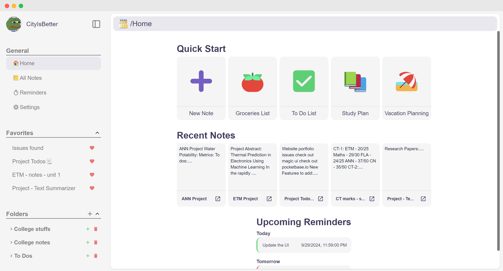

#  NoteScape

NoteScape is a powerful and versatile note-taking app designed to enhance your productivity and organization. Featuring bulletins, to-dos, image uploads, and an AI assistant, NoteScape offers seamless sync across devices and a rich editing experience. read the [blog](https://t.ly/t0ryI) to know how I made this project.

## Features

- **Seamless Sync Across Devices**: Automatically sync your notes with your Google account. Access them from any device, anytime. 📱💻
- **AI Assistant**: Enhance your note-taking with AI-powered autocompletion and interactive responses. Highlight the text and click on "AI complete" to auto-complete sentences. 🤖💬
- **Reminders**: Never miss a task with our upcoming reminders feature.
- **Image Upload**: Easily add images to your notes using the "/image" command or drag and drop. 🖼️📷
- **Organize with Folders**: Keep your notes organized by grouping them into folders. 📂
- **Favorite Notes**: Mark important notes as favorites for quick access. ⭐
- **Kickstart with Templates**: Use pre-designed templates to start your notes quickly and efficiently. 📑
- **Enhanced Note-taking with Novel.sh Editor**: Add todos, quotes, code blocks, headings, images, and more with the powerful Novel.sh editor. 📝🖼️
- **Download Notes as Documents(.docx)**: Download your notes as document as share with your friends or to save locally.

## Tech Stack

- **Frontend**: Next.js 14
- **Backend**: Firebase, Vercel Blob
- **Editor**: Novel.sh (Notion-style WYSIWYG editor with AI-powered autocompletion built with TipTap and Vercel SDK)
- **Server-side Language**: Node.js

## Usage

- Sign in with your Google account.
- Create, edit, and organize notes using the various features provided.
- Use the AI assistant to auto-complete sentences and answer questions.
- Upload images to your notes for a richer experience.
- Organize your notes into folders and mark important notes as favorites.
- Download your notes as document and save it locally.
- Start your notes quickly with templates and enhance them with the Novel.sh editor.

## Contributions

Contributions are welcomed! If you have ideas for improvements or have found bugs, feel free to open an issue or submit a pull request. Let's make NoteScape even better together!

## License

This project is licensed under the MIT License. See the [LICENSE](https://github.com/CityIsBetter/NoteScape/blob/master/LICENSE) file for details.
